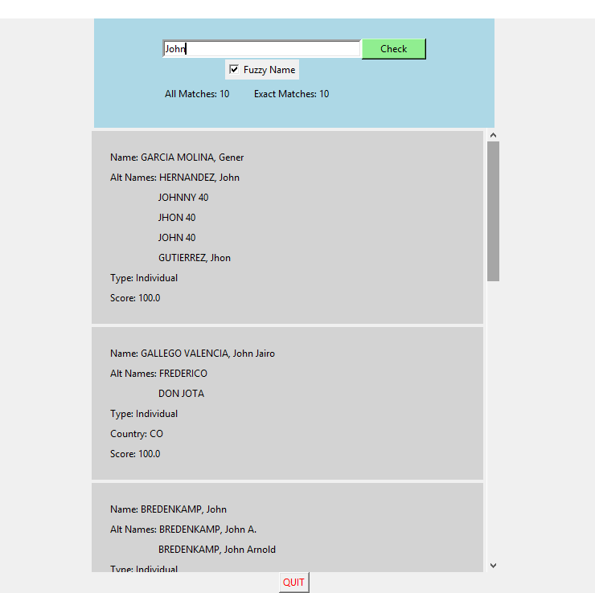

# OFAC-Check

Desktop application used to check names from Office of Foreign Assets Control (OFAC) lists. This is especially useful for Loan Management companies or Community Development Financial Institutions (CDFIs) to check their contacts and businesses against the OFAC lists. 

# To run
1. Download the repo as .zip file or clone it by: 
    `git clone https://github.com/Dostonbek1/OFAC-Check.git`
2. Go into the cloned folder and run the OFAC_APP.exe. It runs on Windows OS.
